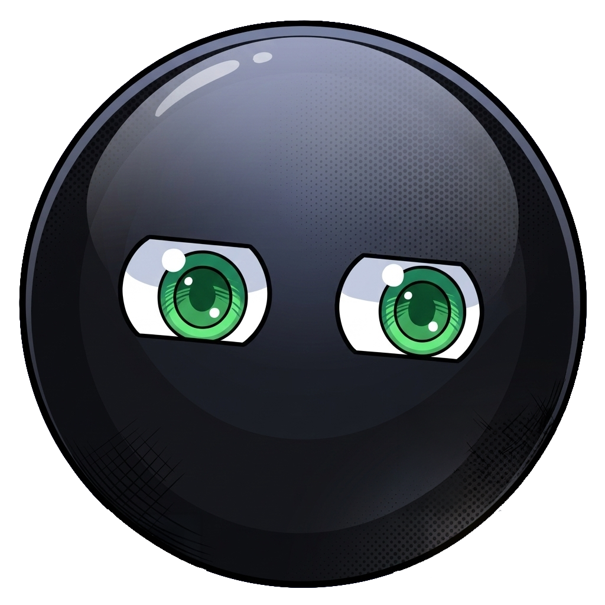
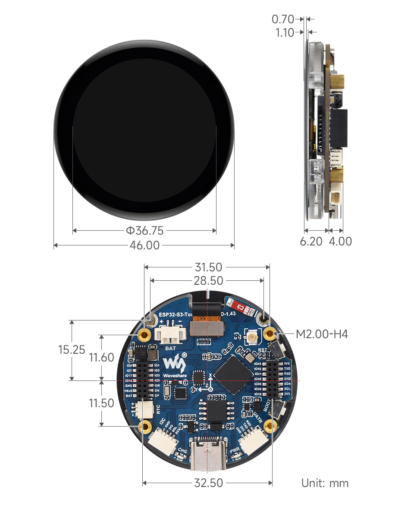

#  esp32_loki

```
              ___                   ________              ___  __                ___         
             |\  \                 |\   __  \            |\  \|\  \             |\  \        
             \ \  \                \ \  \|\  \           \ \  \/  /|_           \ \  \       
              \ \  \                \ \  \\\  \           \ \   ___  \           \ \  \      
               \ \  \____  ___       \ \  \\\  \ ___       \ \  \\ \  \ ___       \ \  \ ___ 
                \ \_______\\__\       \ \_______\\__\       \ \__\\ \__\\__\       \ \__\\__\
                 \|_______\|__|        \|_______\|__|        \|__| \|__\|__|        \|__\|__|
    
    
                              Language Operated Knowledge Interface
```

Short ESP-IDF demo project for the Waveshare ESP32-S3 1.43 inch round AMOLED touch board.

## What it does

- Targets `esp32s3`.
- Initializes the SH8601 AMOLED panel over QSPI.
- Initializes touch input.
- Runs an LVGL animated "cute eyes" UI.

Main app sources:

- `main/example_qspi_with_ram.c`
- `main/cute_eyes.c`

## Requirements

- ESP-IDF v5.x (project dependency: `idf: >5.0.4, !=5.1.1`)
- Board: Waveshare ESP32-S3-Touch-AMOLED-1.43

## 3D Printing Details



Board docs:

- https://www.waveshare.com/esp32-s3-touch-amoled-1.43.htm
- https://www.waveshare.com/wiki/ESP32-S3-Touch-AMOLED-1.43